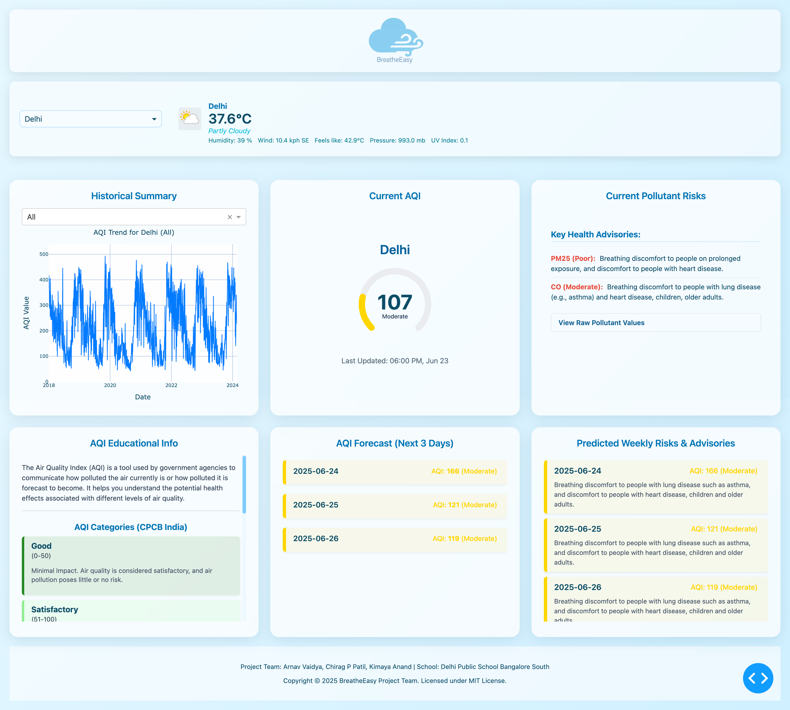

# BreatheEasy: AQI Analysis & Forecasting Dashboard


## Overview

BreatheEasy is a full-stack air quality analysis and forecasting dashboard. It provides a clean, intuitive web interface to:
-   Analyze historical Air Quality Index (AQI) data.
-   Display real-time AQI and weather information for major Indian cities.
-   Generate a 3-day AQI forecast using time-series models enhanced with weather data.
-   Translate complex air quality data into clear, understandable health risks based on the official CPCB (Central Pollution Control Board) standard.

This repository contains the complete source code for the project, including the **Dash-based frontend UI** and a robust **Python backend** for data processing, API integration, and machine learning.

## Dashboard Preview



## Problem Statement

While raw air quality data is increasingly available, it often lacks the context needed for the general public to make informed health decisions. Translating numerical AQI values and pollutant concentrations into tangible health advisories remains a challenge.

BreatheEasy aims to bridge this gap by providing a user-friendly platform that not only presents data but also interprets it. By combining historical analysis, real-time data, and predictive modeling, the application empowers users—especially those with respiratory sensitivities—to better understand and anticipate their local air quality.

## Features

The dashboard is organized into six main sections, providing a comprehensive view of air quality:

*   **1. Historical Summary:** Displays an interactive line chart of historical AQI data, allowing users to visualize long-term trends for any of the target cities.

*   **2. Educational Info:** A static card that explains what the Air Quality Index is and details the different levels of the CPCB (Indian) standard, including their color codes and health implications.

*   **3. Current AQI:** Presents the most recent real-time AQI for the selected city in a clear, color-coded SVG gauge, making the current conditions immediately understandable.

*   **4. AQI Forecast:** Provides a 3-day AQI forecast, generated by a Prophet time-series model that incorporates weather data as regressors for improved accuracy.

*   **5. Current Pollutant Risks:** Fetches real-time data for individual pollutants (like PM2.5, PM10, O3) and displays specific health advisories for any pollutant that exceeds a moderate threshold. Also includes a collapsible section to view raw pollutant values.

*   **6. Predicted Weekly Risks & Advisories:** Combines the 3-day forecast with the CPCB health scale to provide users with forward-looking advice on anticipated air quality conditions for the coming days.

Additionally, the dashboard header includes a **live weather display** for the selected city, showing temperature, conditions, humidity, wind, and more.

## How It Works

The application follows a clear data and logic flow from the backend to the frontend.

1.  **Model Training (Offline Task):**
    *   The `train.py` script loads the historical `Master_AQI_Dataset.csv`.
    *   For each city, it trains a Prophet time-series model using both AQI data and weather features (e.g., temperature, humidity) as regressors.
    *   It saves the trained model (`..._model.json`) and a metadata file containing the model's recent error margin (`..._metadata.json`) to the `/models` directory.

2.  **User Interaction (Live Application):**
    *   A user selects a city in the Dash UI (`app.py`).
    *   This triggers multiple callbacks simultaneously.

3.  **Backend Processing:**
    *   **Forecasting:** The `predictor.py` module loads the pre-trained model for the selected city, fetches a 3-day weather forecast from WeatherAPI.com, and generates a raw AQI forecast. It then refines this prediction by applying the saved historical error margin.
    *   **Real-time Data:** The `client.py` and `weather_client.py` modules fetch current AQI, pollutant levels, and current weather from the AQICN and WeatherAPI.com APIs.
    *   **Data Interpretation:** The `health_rules` modules are used to translate both real-time and predicted AQI values into color codes and health advisories based on the CPCB standard.

4.  **Frontend Display:**
    *   The processed data from the backend is sent back to `app.py`.
    *   The UI is updated dynamically to display the historical graph, current AQI gauge, pollutant risks, and the 3-day forecast with its associated health advisories.

## Technology Stack

The project is built with a focus on a robust Python backend for data science and a reactive Dash frontend for visualization.

### Frontend
*   **Framework:** [Dash](https://dash.plotly.com/)
*   **Core Components:** Dash Core Components, Dash HTML Components
*   **Custom Visualization:** `dash-svg` for the dynamic AQI gauge.
*   **Styling:** Custom CSS for a modern, responsive layout.

### Backend & Data Science
*   **Language:** Python 3.10+
*   **Data Manipulation:** Pandas, NumPy
*   **Time-Series Forecasting:** [Prophet](https://facebook.github.io/prophet/) (from Meta) with `holidays` for seasonality.
*   **API Interaction:** `requests` for fetching data from external sources.

### Development & Tooling
*   **Configuration:** `PyYAML` for `config.yaml`, `python-dotenv` for managing API keys.
*   **Testing:** `pytest` and `pytest-mock` for automated unit and integration testing.
*   **Environment:** Jupyter Notebooks for initial data exploration and model development.

### Data Sources
*   **Historical AQI & Weather:** A user-provided `Master_AQI_Dataset.csv`.
*   **Real-time AQI/Pollutants:** [World Air Quality Index Project (aqicn.org)](https://aqicn.org/api/)
*   **Real-time Weather & Forecast:** [WeatherAPI.com](https://www.weatherapi.com/)

## Project Structure
```
BREATHEEASY/
├── config/                                             # Configuration files
│ └── config.yaml                                       # Main YAML configuration
├── assets                                              # Dash assets folder for CSS and images.
│ └── breatheeasy_logo.png                              # Application logo.
│ └── style.css                                         # Custom CSS for the dashboard.
├── data/                                               # Raw and processed data.
│ └── Post-Processing/
│   └── CSV_Files/
│     └── Master_AQI_Dataset.csv                        # Historical AQI and weather data.
├── models/                                             # Saved machine learning models and metadata.
│ ├── Bangalore_prophet_model_v3_weather.json
│ ├── Bangalore_prophet_metadata_v3_weather.json
│ ├── Chennai_prophet_model_v3_weather.json
│ ├── Chennai_prophet_metadata_v3_weather.json
│ ├── Delhi_prophet_model_v3_weather.json
│ ├── Delhi_prophet_metadata_v3_weather.json
│ ├── Hyderabad_prophet_model_v3_weather.json
│ ├── Hyderabad_prophet_metadata_v3_weather.json
│ ├── Mumbai_prophet_model_v3_weather.json
│ └── Mumbai_prophet_metadata_v3_weather.json
├── scripts/                                            # Standalone helper and processing scripts.                            
│ └── Catogorical_Encoding.py                           # Script for data preprocessing tasks.                      
├── notebook/                                           # Jupyter notebooks for exploration/development
│ ├── 1_Historical_Analysis.ipynb                       # Notebook for Sec 1 analysis ideas
│ └── 2_AQI_Forecasting_Development.ipynb               # Notebook for Sec 4 model dev/eval ideas
├── src/                                                # Core backend source code.
│ ├── init.py
│ ├── config_loader.py                                  # Loads config.yaml, sets up logging
│ ├── exceptions.py                                     # Custom exception classes
│ ├── analysis/                                         # Historical data analysis functions
│ │ ├── init.py
│ │ └── historical.py
│ ├── api_integration/                                  # External API clients
│ │ ├── init.py
│ │ ├── client.py                                       # AQICN API client (AQI/Pollutants)
│ │ └── weather_client.py                               # WeatherAPI.com client (Current & Forecast)
│ ├── health_rules/                                     # AQI scales, thresholds, interpretation
│ │ ├── init.py
│ │ ├── info.py                                         # AQI scale definitions (CPCB)
│ │ └── interpreter.py                                  # Pollutant risk interpretation (Sec 5)
│ └── modeling/                                         # ML model training and prediction
│ ├── init.py
│ ├── predictor.py                                      # Loads models, generates forecasts (Sec 4 & 6)
│ └── train.py                                          # Trains and saves models for all cities
├── tests/                                              # Automated tests
│ ├── init.py
│ ├── api_integration/
│ │ ├── init.py
│ │ ├── test_client.py
│ │ └── test_weather_client.py
│ └── health_rules/
│ ├── init.py
│ ├── test_info.py
│ └── test_interpreter.py
├── .env                                                # Local environment variables (API keys). Not in git.
├── .gitignore                                          #Specifies files for Git to ignore.
├── requirements.txt                                    # Python package dependencies.
├── run_full_test.py                                    # Script for end-to-end backend testing.
├── app.py                                              # Main Dash application file (UI and callbacks).
└── README.md                                           # This file
```

## Setup and Usage

Follow these steps to set up and run the BreatheEasy dashboard on your local machine.

### 1. Prerequisites
- Python 3.10 or newer.
- `git` installed on your system.

### 2. Clone the Repository
```bash
git clone https://github.com/cp099/BreatheEasy.git
cd BreatheEasy
```
### 3. Set Up a Virtual Environment
it is strongly recommended to use a virtual environment to manage project dependencies.
```bash
# Create the virtual environment (on macOS/Linux)
python3 -m venv venv

# Create the virtual environment (on Windows)
python -m venv venv

# Activate the environment (on macOS/Linux)
source venv/bin/activate

# Activate the environment (on Windows PowerShell)
.\venv\Scripts\Activate.ps1
```

### 4. Install Dependencies
Install all required Python packages from the `requirements.txt` file.
```bash
pip install -r requirements.txt
```
> **Note:** If you encounter issues installing prophet, please refer to its official [installation guide](https://facebook.github.io/prophet/docs/installation.html#installation-in-python), as it may have specific system-level dependencies.

### 5. Configure API Keys
The application requires API keys from two services to fetch real-time data.

1. **Create the `.env` file:** In the root directory of the project (`BreatheEasy/`), create a new file named `.env`.
2. **Get API Keys:**
  - **WeatherAPI:** Sign up for a free key at [weatherapi.com](weatherapi.com)
  - **AQICN:** Get a free token from the [World Air Quality Index Project](https://aqicn.org/data-platform/token/).
3. **Add Keys to `.env`:** Open the `.env` file and add your keys in the following format:
  ```bash
  WEATHERAPI_API_KEY="YOUR_ACTUAL_WEATHERAPI_KEY_HERE"
  AQICN_API_TOKEN="YOUR_ACTUAL_AQICN_TOKEN_HERE"
  ```
> **Security Note:** The `.gitignore` file is already configured to prevent your `.env` file from being committed to Git.

### 6. Run the Application
With the setup complete, you can now run the Dash application directly using the included models.

```bash
python app.py
```
The application will start, and you can access the dashboard by navigating to http://localhost:8050 in your web browser.

---

### Advanced Usage

#### (Optional) Retraining the Forecast Models

If you wish to retrain the models with your own data or different settings:

1.  **Prepare Data File:** Place your primary data file, named `Master_AQI_Dataset.csv`, in the `data/Post-Processing/CSV_Files/` directory. This file is crucial and **must** contain the following columns with clean, daily data:
    *   `Date`: The date of the reading (e.g., `DD/MM/YY`).
    *   `City`: The name of the city.
    *   `AQI`: The target variable for prediction.
    *   **Weather Regressor Columns:** Columns whose names exactly match those listed in the `weather_regressors` section of `config.yaml` (e.g., `temperature_2m`, `relative_humidity_2m`, etc.).
2.  **Configure:** Modify `config/config.yaml` to adjust settings like `target_cities` or `weather_regressors` if needed.
3.  **Run Training Script:** Execute the training script from the root directory. This will overwrite the existing model files in the `models/` directory.
    ```bash
    python src/modeling/train.py
    ```

#### (Optional) Running Backend Tests

To verify that the backend components are functioning correctly, you can run the following commands from the root directory:

*   **Run all automated tests:**
    ```bash
    pytest
    ```

*   **Run the end-to-end simulation script:**
    ```bash
    python run_full_test.py
    ```

---

## Contributing

Contributions to the BreatheEasy project are welcome! If you have suggestions for improvements or find any issues, please feel free to:

1.  **Open an Issue:** Describe the bug or feature proposal in detail.
2.  **Fork the Repository:** Create your own copy of the project.
3.  **Create a Feature Branch:** (`git checkout -b feature/AmazingFeature`)
4.  **Commit Your Changes:** (`git commit -m 'Add some AmazingFeature'`)
5.  **Push to the Branch:** (`git push origin feature/AmazingFeature`)
6.  **Open a Pull Request:** Create a PR back to the main repository with a clear description of your changes.

## License

This project is distributed under the MIT License. See the `LICENSE` file for more information.

---
_This README was last updated on June 23, 2024._